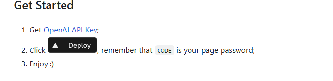
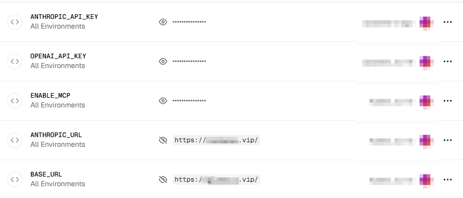
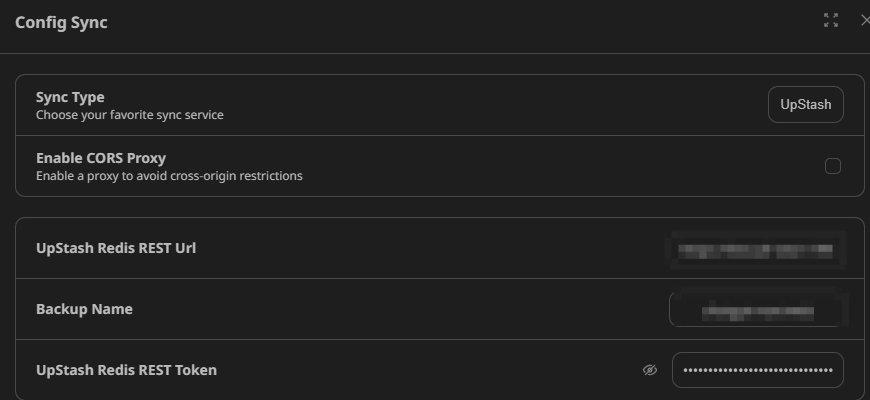
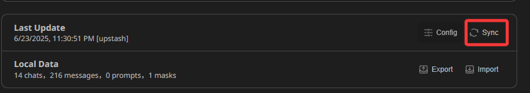
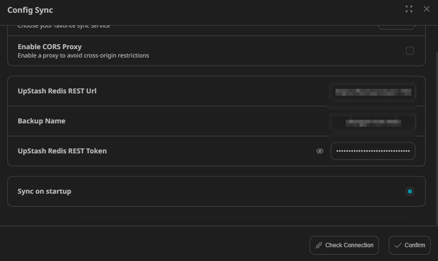

# NextChat

A nice cross-platform customizable AI assitant. See its [Official repo](https://github.com/ChatGPTNextWeb/NextChat). 

Allows handling sessions with different AI models in a single privately-deployed webpage.


## Deployment

Deploying NextChat with vercel is a no-brainer, everything can be done by simply following the vercel `Deploy` button in NextChat's manual.



Before the deployment, several key enviroment variables are set:

- `ENABLE_MCP`: true
- `ANTHROPIC_URL`, `BASE_URL`: since AI proxy platform is used, these URLs are set to the URL provided by the AI proxy platform
- Other environment variables are set according to the manual



## Sync it up

On daily basis, I have to operate on multiple PC/laptops, cross device sync-up is hence a must. NextChat has built-in support to sync up data with [UpStash](https://upstash.com/), which is nice because UpStash provides free database service. (well, free until certain extent of usage but it is generally enough for personal use of NextChat). 

Configuration: simply enters the endpoint and token of the UpStash database in setting page of NextChat.



### QOL improvement: auto-sync

As I said, as a heavy multi-device user, I found that using nextchat's native sync-up function is kinda painful. Everytime I have to actively click a `Sync` button that's hidden in a menu. So I decided to customize my NextChat to include an auto-sync function.



Well before getting into dirty works, let's actually look for any existing efforts so that I won't reinvent the wheels. And it took me 5 seconds to find one! Someone who actually knows how to develop TypeScript webapp has submitted a PR to include autosyncing, but the PR is never merged (as of today):

https://github.com/ChatGPTNextWeb/NextChat/pull/5700


I simply downloaded the PR and applid the changes as a patch. 

```
git checkout -b pr5700-clean main
curl -L https://github.com/ChatGPTNextWeb/NextChat/pull/5700.patch -o pr5700.patch 
git apply --reject pr5700.patch
```

A few easy conflicts are solved when applying the patch, then I changed the default settings of autosync to true in `app/store/sync.ts`, lazy man I am.

```
42  autoSync: {
43  onStart: true,
44  },
```

After pushing the changes and redeploy the application in vercel, NextChat will now autosync everytime the webpage is launched



## TODO

- AutoSync everytime a response is returned from AI
