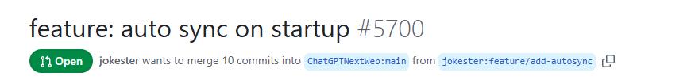
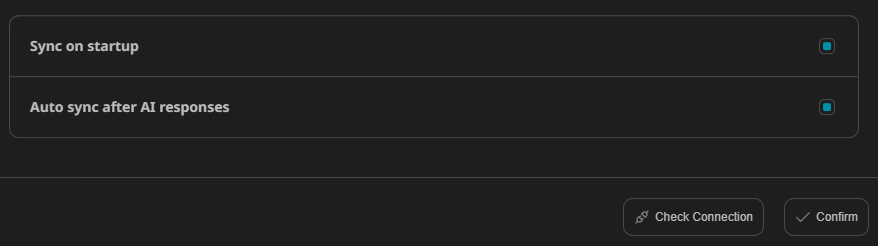
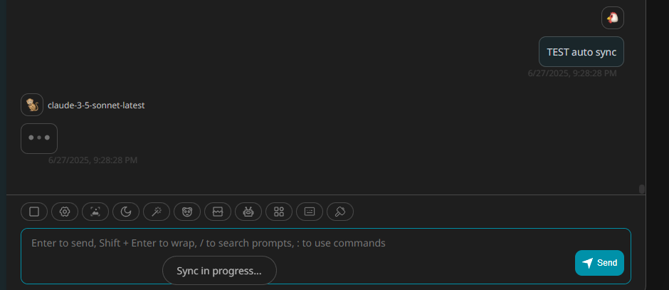

# NextChat

A nice cross-platform customizable AI assitant. See its [Official repo](https://github.com/ChatGPTNextWeb/NextChat). 

Handling sessions with different AI models in a single privately-deployed web app.


## Deployment

Deploying NextChat with vercel is a no-brainer, everything can be done by simply following the vercel `Deploy` button in NextChat's manual.


Before my deployment, several key enviroment variables are set:

- `ENABLE_MCP`: true
- `ANTHROPIC_URL`, `BASE_URL`: since AI proxy platform is used, these URLs are set to the URL provided by the AI proxy platform
- Other environment variables are set according to the manual


## Sync it up

On daily basis, I have to operate on multiple PC/laptops, cross device sync-up is hence a must. NextChat has built-in support to sync up data with [UpStash](https://upstash.com/), which is nice because UpStash provides free database service. (well, free until certain extent of usage but it is generally enough for personal use of NextChat). 

Configuration: simply enters the endpoint and token of the UpStash database in setting page of NextChat.


### QOL improvement part I: auto-sync on start-up

As I said, as a heavy multi-device user, I found that using nextchat's native sync-up function is kinda painful. Everytime I have to actively click a `Sync` button that's hidden in a menu. So I decided to customize my NextChat to include an auto-sync function.


Well before getting into dirty works, let's look for any existing efforts so that I won't reinvent the wheels. It took me 5 seconds to find one! Someone who actually knows how to develop TypeScript webapp has submitted a PR to include autosyncing, but the PR is never merged (as of today):

https://github.com/ChatGPTNextWeb/NextChat/pull/5700




I simply downloaded the PR and applid the changes as a patch. 

```
git checkout -b pr5700-clean main
curl -L https://github.com/ChatGPTNextWeb/NextChat/pull/5700.patch -o pr5700.patch 
git apply --reject pr5700.patch
```

A few easy conflicts are solved when applying the patch, then I changed the default settings of autosync to true in `app/store/sync.ts`, lazy man I am.

```
42  autoSync: {
43  onStart: true,
44  },
```

After pushing the changes and redeploy the application in vercel, NextChat will now autosync everytime the webpage is launched


### QOL improvement PART II: auto-sync everytime

Obviously having auto-sync only at the start-up of the web app is not gonna be enough. I decided to add a feature that allows auto-sync on every response from AI.

Despite not knowing anything about TypeScript, this task can still be easily done with the help of Claude. 

Firstly, a hook for every AI response `useAutoSyncOnResponse()` is created in `app/components/home.tsx`. Then function `Screen()` is modified to run the hook.

```
@@ -194,6 +194,39 @@ function useSyncOnStart() {
  }, [storeHasHydrated]);
}

// Hook for every AI response
function useAutoSyncOnResponse() {
  const syncStore = useSyncStore();
  const storeHasHydrated = useSyncStore((s) => s._hasHydrated);

  useEffect(() => {
    if (!(storeHasHydrated && syncStore.cloudSync())) return;

    // Function to handle AI response events
    const handleAIResponse = async () => {
      const dismissSyncingToast = showToast(Locale.Settings.Sync.IsSyncing);
      try {
        await syncStore.sync();
        dismissSyncingToast();
        showToast(Locale.Settings.Sync.Success);
      } catch (e: unknown) {
        dismissSyncingToast();
        showToast(Locale.Settings.Sync.Fail);
        console.error("[Sync] Auto-sync after AI response failed:", e);
      }
    };

    // Add event listener for AI responses
    window.addEventListener("ai-response-received", handleAIResponse);

    // Cleanup function to remove event listener
    return () => {
      window.removeEventListener("ai-response-received", handleAIResponse);
    };
  }, [storeHasHydrated, syncStore]);
}


function Screen() {
  const config = useAppConfig();
  const location = useLocation();
@@ -211,6 +244,7 @@ function Screen() {
    loadAsyncGoogleFont();
  }, []);
  useSyncOnStart();
  useAutoSyncOnResponse();
```

Next, we need to update `app/components/chat.tsx` to dispatch the event to whenever an AI responds:

```
@@ -1114,7 +1114,12 @@ function _Chat() {
    setIsLoading(true);
    chatStore
      .onUserInput(userInput, attachImages)
      .then(() => setIsLoading(false));
      .then(() => {

        setIsLoading(false);
        // Dispatch event to trigger auto-sync when AI responds
        window.dispatchEvent(new Event("ai-response-received"));
      });
    setAttachImages([]);
    chatStore.setLastInput(userInput);
    setUserInput("");
```

At this step, we should be all set. Everytime there is an AI response, the hook will be triggered so that the auto-sync will happen. 

#### Optional Autosync

Despite the fact that I believe for at least 90% of the time I will want to have this feature in action, it is still better practice to leave it as an option. To achieve this, we have to 
 - add a simple logic check in the hook, and 
 - update the UI. 
  
Again, easy task :) 

Add check for option in the hook in `app/components/home.tsx`:
```
@@ -200,7 +200,8 @@ function useAutoSyncOnResponse() {
  const storeHasHydrated = useSyncStore((s) => s._hasHydrated);

  useEffect(() => {
    // Add check for onResponse config option
    if (!(storeHasHydrated && syncStore.cloudSync() && syncStore.autoSync.onResponse)) return;

    // Function to handle AI response events
    const handleAIResponse = async () => {
```

Update UI in `app/components/settings.tsx`:

```
@@ -494,6 +494,19 @@ function SyncConfigModal(props: { onClose?: () => void }) {
              }}
            />
          </ListItem>
          <ListItem title={Locale.Settings.Sync.Config.AutoSync.OnResponse}>
            <input
              type="checkbox"
              checked={syncStore.autoSync.onResponse}
              onChange={(e) => {
                syncStore.update(
                  (config) =>
                    (config.autoSync.onResponse = e.currentTarget.checked),
                );
              }}
            />
          </ListItem>

        </List>
      </Modal>
    </div>
```

`app/locales/cn.ts`:
```
@@ -259,6 +259,7 @@ const cn = {

        AutoSync: {
          OnStartup: "启动时自动同步",
          OnResponse: "AI响应时自动同步",
        },
      },

```

`app/locales/en.ts`:
```
@@ -262,6 +262,7 @@ const en: LocaleType = {

        AutoSync: {
          OnStartup: "Sync on startup",
          OnResponse: "Auto sync after AI responses",
        },
      },

```

Enable the auto sync on AI response by default in `app/store/sync.ts`:

```
@@ -41,6 +41,7 @@ const DEFAULT_SYNC_STATE = {

  autoSync: {
    onStart: true,
    onResponse: true, 
  },

  lastSyncTime: 0,
```

Re-deployed NextChat, we now have the options to enable auto sync on AI reponses. And it just works!




### AutoSync patch

The modified files containing features mentioned above can be found at https://github.com/trident91/NextChat-AutoSync-Patch/tree/main


## TODO

- Figure out a practical and convenient workflow to involve MCP (Ghidra-MCP, IDA-MCP, .......)